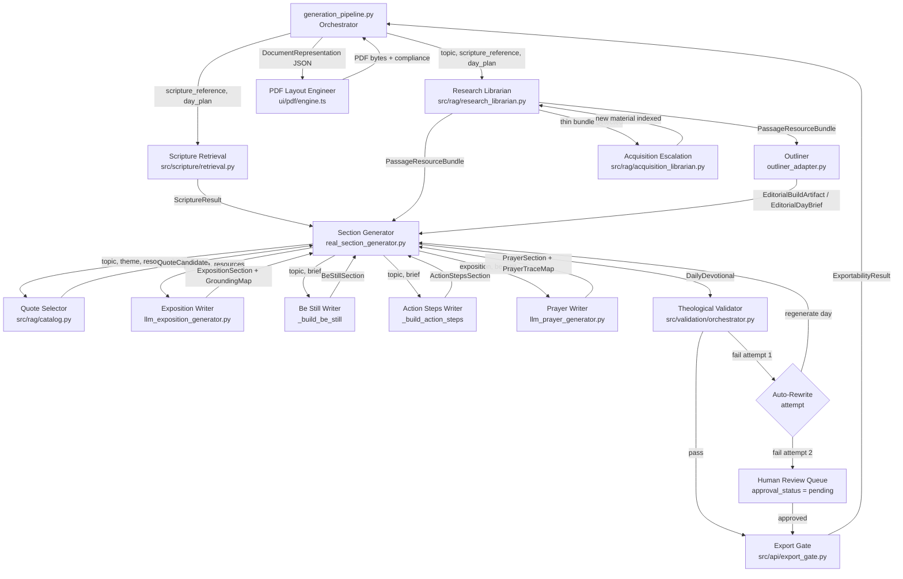

# Pipeline Reference — DevG Production Pipeline

**Last updated:** 2026-03-18
**Source:** `src/api/generation_pipeline.py` and referenced files; PRD_v16.md (authoritative)

This document describes every worker in the DevG generation pipeline: what each one owns, where it gets input, what it produces, and how it relates to PRD requirements. Workers are listed in pipeline execution order.

---

## 1. Scripture Retrieval

**Implementation status:** Implemented
**LLM or deterministic:** Deterministic (HTTP calls to Bolls.life / API.Bible; no LLM)
**Implementation files:**
- `src/scripture/retrieval.py` — priority chain, validation, failure alert
- `src/scripture/book_ids.py` — Bolls.life integer book ID mapping
- `src/scripture/planner.py` — day reference planning, study window sizing

### Responsibilities
- Retrieve scripture text using NASB (or configured translation) via priority chain: Bolls.life → API.Bible → operator import file
- Retry primary source once before falling to secondary
- Validate retrieved verse against requested reference (translation code, book, chapter, verse number, non-empty text)
- Return a structured `ScriptureFailureAlert` when all sources are exhausted
- Maintain a local Bolls.life book ID mapping table
- Honor operator-provided import file (`verification_status = operator_provided`)

### Gets input from
- `generation_pipeline.py` — scripture reference string derived from `day_plan` or the top-level `scripture_reference` argument
- `src/scripture/planner.py` — `plan_scripture_day_references()` produces per-day reference windows; `select_daily_key_verses_reference()` narrows to key verse(s)
- Environment: optional `api_bible_key` for the secondary source; optional import file path

### Gives output to
- `real_section_generator.py` → `ScriptureResult` (reference, text, translation, source metadata) used to populate `ScriptureSection`
- On failure: `ScriptureFailureAlert` (failure_mode, reference, source) returned to the caller for operator surfacing

### Other workers it interacts with
- `src/scripture/planner.py` is called by `generation_pipeline.py` before retrieval to produce the day plan; Scripture Retrieval itself does not call the planner

### Output artifact
- `ScriptureResult` (Pydantic model in `src/scripture/retrieval.py`): `reference`, `text`, `translation`, `source`
- `ScriptureFailureAlert` (dataclass) on failure: `failure_mode`, `reference`, `source`

### Failure / escalation path
- Primary (Bolls.life) fails: retry once, then attempt API.Bible if key present
- API.Bible absent or fails: check operator import file
- All sources exhausted: return `ScriptureFailureAlert` with `failure_mode = ALL_SOURCES_EXHAUSTED`; caller surfaces structured alert to operator; empty Scripture field is flagged by validator; publish-ready export blocked until operator enters and approves scripture text

### External dependencies
- `https://bolls.life` API (no authentication required)
- `https://api.bible` API (requires `api_bible_key` in operator config for NASB)
- Optional operator-provided import file (CSV / JSON)
- `src/scripture/book_ids.py` local mapping table (bundled)

### PRD requirements owned
| FR/AC/TC | Description | Coverage |
|---|---|---|
| FR-57 | Scripture retrieval via approved sources in priority order; operator import path | Full |
| FR-58 | Validate retrieved text matches requested reference | Full |
| FR-59 | Failure protocol: retry, fallback chain, failure alert, operator entry, export block | Full |
| FR-60 | Configurable scripture version (NASB, NIV, ESV, KJV, NKJV, NLT) | Full |
| AC-36 | Scripture text retrieved and validated | Full |

### PRD gap notes
- `FR-60` supported translations are implemented via the `translation` parameter; actual test coverage of all six versions is unverified.
- The export block for failed/empty scripture (FR-59f) depends on Export Gate checking approval status — ExportGate does check this for sections present in the book model.

---

## 2. Research Librarian

**Implementation status:** Implemented (LLM curation conditional on API key availability; falls back to deterministic bundle silently)
**LLM or deterministic:** LLM (Claude or Codex, via `DEVG_LLM_RESEARCH_LIBRARIAN` or `DEVG_LLM_PROVIDER`) + deterministic RAG retrieval layer
**Implementation files:**
- `src/rag/research_librarian.py` — orchestrator, `prepare_passage_resource_bundle()`
- `src/rag/llm_research_librarian_core.py` — LLM seminary librarian: `curate_passage_bundle()`
- `src/rag/exposition.py` — `ExpositionRAG` retrieval engine
- `src/rag/library_catalog.py` — catalog-level resource selection
- `src/rag/acquisition_librarian.py` — `escalate_for_passage()` for thin bundle escalation
- `src/rag/research_memory.py` — outline candidate memory

### Responsibilities
- Execute deterministic RAG retrieval against the local exposition index for context and theological excerpt sets
- Invoke LLM seminary librarian to annotate each resource with passage-specific notes and assess whether the bundle is thin
- When thin: suggest additional search terms and perform supplemental retrieval
- Load reading note hints (one-liner resource awareness sentences) and include them in the shared bundle
- Build per-day exposition resource packages when a `day_plan` is supplied
- Build `outliner_resources` from outline memory and catalog
- Detect thin bundles and escalate to acquisition pipeline (`escalate_for_passage()`)
- When new material is indexed after escalation, rebuild the bundle before returning

### Gets input from
- `generation_pipeline.py` → calls `prepare_passage_resource_bundle(topic, scripture_reference, db_path, num_days, day_plan)`
- `src/rag/exposition.py` → `ExpositionRAG.retrieve_for_paragraph()` for raw excerpt candidates
- `data/library/reading-notes/drafts/*.json` → reading note hints
- `data/library/resource-catalog.json` → catalog resource metadata

### Gives output to
- `generation_pipeline.py` → `PassageResourceBundle` stored as `passage_resources`, passed to every downstream worker
- `outliner_adapter.py` / `build_editorial_artifact()` → `outliner_resources` from `PassageResourceBundle.outliner_resources`
- `real_section_generator.py` / `LLMExpositionGenerator` → `exposition_resources` and `exposition_resources_by_day` from `PassageResourceBundle`

### Other workers it interacts with
- Acquisition Librarian (`escalate_for_passage()`): triggered automatically when bundle is thin (< 4 exposition resources or < 2 outliner resources)
- Library Trainer: reads the research librarian's reading notes and request history; can direct the librarian to serve from current holdings vs. escalate
- Training Manager (autoresearch loop): invokes `prepare_passage_resource_bundle()` during outliner and exposition training cycles

### Output artifact
`PassageResourceBundle` (Pydantic model in `src/models/pipeline.py`):
- `topic`, `scripture_reference`, `prepared_at_utc`
- `shared_resources: list[PassageResourceRecord]` — for all workers
- `outliner_resources: list[PassageResourceRecord]` — outliner-targeted
- `exposition_resources: list[PassageResourceRecord]` — exposition writer flat list
- `exposition_resources_by_day: dict[int, list[PassageResourceRecord]]` — per-day packages

### Failure / escalation path
- LLM curation unavailable (no API key): falls back to deterministic bundle silently; no error raised
- Bundle thin after curation: automatically calls `escalate_for_passage()`; if new rows indexed, rebuilds bundle (one rebuild pass with `_skip_escalation=True`)
- Acquisition produces no new material: returns the thin bundle as-is; downstream workers receive reduced resource set

### External dependencies
- `ANTHROPIC_API_KEY` or `OPENAI_API_KEY` environment variable (LLM curation)
- `DEVG_LLM_RESEARCH_LIBRARIAN` or `DEVG_LLM_PROVIDER` routing env var
- Local exposition index (SQLite / vector store via `ExpositionRAG`)
- `data/library/` directory: `resource-catalog.json`, reading notes, resource holdings
- `default_registry_db_path()` SQLite database for outline memory

### PRD requirements owned
| FR/AC/TC | Description | Coverage |
|---|---|---|
| FR-17 | Retrieve from ten approved theological sources before generating exposition | Partial — infrastructure in place; coverage depends on what is indexed in the local catalog |
| FR-18 | Commentary sources → Paragraphs 2 & 3; reference works → Paragraph 2 | Partial — retrieval separates "context" and "theological" purposes; full paragraph routing depends on exposition generator |
| FR-19 | Produce Grounding Map alongside every exposition (retrieved sources per paragraph) | Partial — bundle provides excerpts; GroundingMap is built by `LLMExpositionGenerator`, not by Research Librarian directly |
| TC-03 | Agentic RAG: plan retrieval → retrieve → reason → generate → Grounding Map | Partial — retrieval and LLM annotation are present; the full "plan → retrieve → reason → iterate" loop is not yet fully closed in the pipeline |

### PRD gap notes
- FR-17 lists ten specific source works. Coverage depends on what has been indexed into the local catalog. The infrastructure accepts any indexed source; which of the ten mandated sources are actually indexed is a catalog-state question, not a code gap.
- The full agentic RAG loop (TC-03 steps 5–6: evaluate output, iterate retrieval if it fails) is not yet implemented in the pipeline; the current architecture does one retrieval pass with optional LLM annotation but does not re-retrieve on exposition quality failure.

---

## 3. Passage Resource Collector

**Implementation status:** Implemented (thin wrapper; delegates entirely to Research Librarian)
**LLM or deterministic:** Delegates to Research Librarian
**Implementation files:**
- `src/generation/passage_resource_collector.py` — `collect_passage_resources()` wrapper

### Responsibilities
- Thin adapter that calls `prepare_passage_resource_bundle()` with full study context (topic, passage, duration, day plan)
- Provides named entry point for the exposition writer to request resources

### Gets input from
- `generation_pipeline.py` or exposition writer path → topic, scripture_reference, db_path, num_days, day_plan

### Gives output to
- Downstream exposition writer path → `PassageResourceBundle` (identical to Research Librarian output)

### Other workers it interacts with
- Research Librarian (complete delegation)

### Output artifact
`PassageResourceBundle` — same as Research Librarian output

### Failure / escalation path
Same as Research Librarian

### External dependencies
Same as Research Librarian

### PRD requirements owned
This worker owns no PRD requirements independently — it is a pass-through to the Research Librarian. See Research Librarian for FR-17, FR-18, FR-19.

### PRD gap notes
None — this is an organizational wrapper, not a functional boundary.

---

## 4. Outliner

**Implementation status:** Implemented — `reasoning` mode (deterministic, default) with LLM burden/lane enrichment callable; `llm` mode (comparison baseline, not training path); `legacy` mode (original cue engine, baseline only)
**LLM or deterministic:** Deterministic (reasoning mode, default pipeline worker); LLM optional burden/lane enrichment via `llm_outliner_core.build_llm_burden_lane()` (DEVG_LLM_OUTLINER provider)
**Implementation files:**
- `src/autoresearch/outliner_adapter.py` — mode routing (`reasoning` / `llm` / `legacy`)
- `src/autoresearch/reasoning_outliner_core.py` — default deterministic engine: genre detection, day/week boundaries, burden/lane templates
- `src/autoresearch/llm_outliner_core.py` — LLM burden/lane generator + comparison mode

### Responsibilities
- Detect literary genre of each passage segment
- Assign natural day boundaries across the scripture range
- Compute week numbers and week turns
- Assign pastoral burden and theological lane for each day
- Generate focus clauses, forbidden drifts, key terms, scene summaries
- Produce week plan summaries with movement descriptions
- Accept `PassageResourceBundle.outliner_resources` for context

### Gets input from
- `generation_pipeline.py` → calls `build_editorial_artifact()` (via `src/generation/editorial.py`) which internally uses the outliner path; receives `topic`, per-day `scripture_reference` / `study_window_reference`, and `passage_resources`

### Gives output to
- `generation_pipeline.py` → `EditorialBuildArtifact` stored as `editorial_build`; per-day `EditorialDayBrief` objects used by section generators
- Every section generator (`real_section_generator.py`, `LLMExpositionGenerator`) receives the `EditorialDayBrief` as directional context

### Other workers it interacts with
- Research Librarian: receives `outliner_resources` from `PassageResourceBundle`
- Theological Reviewer (autoresearch only): available on-demand when outliner struggles with a passage (2+ failures)
- Outliner Training Agent: evaluates completed outlines; LLM cross-evaluator scores structural quality

### Output artifact
`EditorialBuildArtifact` (Pydantic model in `src/models/pipeline.py`):
- `topic`, `num_days`, `source_reference`, `week_count`
- `day_plan: list[EditorialDayPlanRow]`
- `day_briefs: list[EditorialDayBriefRecord]` — each with `day_title`, `focus_clause`, `pastoral_burden`, `genre`, `scene_summary`, `theological_lane`, `application_lane`, `forbidden_drifts`, `key_terms`
- `week_plans: list[EditorialWeekPlan]`
- `passage_resources: PassageResourceBundle | None`

### Failure / escalation path
- Reasoning mode: fully deterministic; no failure path
- LLM mode: if LLM call fails, the outliner adapter does not catch this; would bubble to pipeline
- The pipeline does not currently have an outliner-specific retry path; an outliner failure would fail the entire run

### External dependencies
- `DEVG_OUTLINER_MODE` env var (`reasoning` default, `llm`, or `legacy`)
- LLM API key (only when `DEVG_OUTLINER_MODE=llm` or when LLM burden/lane enrichment is active within reasoning mode)
- `default_registry_db_path()` SQLite for outline memory candidates (via `research_memory.load_outline_candidates()`)

### PRD requirements owned
| FR/AC/TC | Description | Coverage |
|---|---|---|
| FR-01 | Four-paragraph structure — outputs `focus_clause`, `pastoral_burden`, `theological_lane` per day to guide the exposition writer | Partial — provides editorial direction; actual four-paragraph enforcement is on the exposition writer |
| FR-12 | Genre-aware handling of passages | Full (deterministic genre detection in `reasoning_outliner_core`) |
| TC-03 | Agentic RAG: plan retrieval strategy before generation | Partial — outliner receives `outliner_resources` but the retrieval planning step is in Research Librarian, not the outliner itself |

### PRD gap notes
- The Outliner's primary PRD role is editorial direction for the exposition writer, not a direct FR owner. Its quality (genre-aware burdens, natural boundaries) is a prerequisite for exposition quality, which maps to FR-01 through FR-16.

---

## 5. Quote Selector

**Implementation status:** Partially implemented — `QuoteCatalog` in `src/rag/catalog.py` is implemented (deterministic keyword scoring from `data/quotes/seed-quotes.json`); no dedicated LLM quote-selection agent in the pipeline; `real_section_generator.py` calls the catalog directly
**LLM or deterministic:** Deterministic (keyword-overlap scoring, alphabetical tie-breaking; no embeddings, no LLM calls)
**Implementation files:**
- `src/rag/catalog.py` — `QuoteCatalog`: loads seed JSON, scores by keyword overlap, checks author whitelist, checks approved source domains
- `data/quotes/seed-quotes.json` — 90 public-domain quotes
- `src/generation/real_section_generator.py` — calls `QuoteCatalog.retrieve()` during day generation

### Responsibilities
- Retrieve candidate quotes from the local catalog by semantic topic match (keyword overlap)
- Filter to approved author whitelist (17 authors, Section 10.4) and approved source domains (Section 10.5)
- Enforce date range (1483–1952)
- Return structured shortage warning when fewer than 3 viable candidates found
- Populate `TimelessWisdomSection` with quote text, author, source title, publication year, citation locator/URL
- Exclude forbidden quote texts (de-duplication: within-volume and cross-volume via `forbidden_quote_texts`)

### Gets input from
- `real_section_generator.py` → `topic`, `scripture_reference`, `forbidden_quote_texts: set[str]`

### Gives output to
- `real_section_generator.py` → `QuoteCandidate` → `TimelessWisdomSection`
- `ExportGate` checks Turabian completeness on `TimelessWisdomSection` fields

### Other workers it interacts with
- Series Registry (`generation_pipeline.py`): after generation, `registry.record_quote_use()` persists used quotes for cross-volume de-duplication
- Export Gate: checks that `author`, `source_title`, `publication_year`, and `citation_locator_or_source_url` are non-empty before PUBLISH_READY export

### Output artifact
`QuoteCandidate` (interface in `src/interfaces/rag.py`): `quote_text`, `author`, `source_title`, `publication_year`, `page_or_url`, `public_domain`, `verification_status`

### Failure / escalation path
- Fewer than 3 candidates: `warnings.warn()` with structured shortage message; pipeline continues with available candidates
- Zero candidates: pipeline would proceed with no quote — this path is not currently blocked; the validator may catch an empty `timeless_wisdom` field
- Publish-ready export: `ExportGate` blocks export if Turabian fields are missing
- FR-52 live retrieval fallback: not yet implemented — the catalog falls back to the shortage warning but does not attempt live retrieval from approved sites

### External dependencies
- `data/quotes/seed-quotes.json` — 90 seed quotes (local file, bundled)
- `default_registry_db_path()` SQLite — for cross-volume de-duplication queries (via `load_quote_rows()`)

### PRD requirements owned
| FR/AC/TC | Description | Coverage |
|---|---|---|
| FR-49 | Quotes from verified catalog only; AI recall prohibited | Full (catalog-only path, no LLM recall) |
| FR-50 | Approved author whitelist and approved source domains | Full |
| FR-51 | Cached RAG architecture; local vector database | Partial — implemented as keyword scoring, not vector similarity; PRD Flag 1 applies |
| FR-52 | Live fallback when fewer than 3 candidates; shortage alert; manual substitution path | Partial — shortage warning is emitted; live retrieval fallback is NOT implemented; manual substitution path is not implemented |
| FR-53 | Full Turabian attribution (author, title, year, page/URL) | Partial — fields are present on `TimelessWisdomSection`; completeness checked by Export Gate, not enforced at retrieval time |
| FR-55 | No publish-ready export unless `verification_status = human_approved` and `public_domain = true` | Partial — Export Gate checks Turabian fields; `verification_status` and `public_domain` flags are in the model but ExportGate does not explicitly check them (only checks Turabian fields) |
| FR-64 | Series-level de-duplication registry | Partial — registry records quote use; within-volume de-duplication is enforced by `generation_pipeline.py`; cross-volume checked via `forbidden_quote_texts` |
| FR-65 | Flag cross-series duplicate without operator override | Partial — de-duplication logic exists but the series registry cross-volume check path is unverified |
| FR-66 | No within-volume quote duplication | Full — enforced in `generation_pipeline.py` |
| FR-68 | Author diversity report | Not implemented — data is recorded in registry but report generation is not implemented |
| FR-71 | Child volume weighting toward underrepresented authors | Not implemented |
| AC-34 | Verified Turabian attribution, public_domain=true, block quote rendering | Partial — citation fields present; block quote rendering is PDF worker responsibility; public_domain flag check is partial |
| AC-39 | Quote de-duplication check passed | Partial — within-volume enforced; cross-volume partial |
| TC-02 | Cached RAG; vector-indexed corpus; live fallback | Partial — cached retrieval implemented (keyword scoring); live fallback NOT implemented |

### PRD gap notes
- FR-52 live retrieval from approved public domain sites is not implemented. If the local catalog has fewer than 3 candidates, the system emits a warning but does not attempt live retrieval.
- FR-68 author diversity report: the registry records data but no report is generated or displayed.
- FR-55 `verification_status` and `public_domain` checks are not explicitly gated in ExportGate — it only checks the four Turabian structural fields.

---

## 6. Exposition Writer

**Implementation status:** Implemented — `LLMExpositionGenerator` (LLM-backed) exists and is wired; `real_section_generator._build_exposition()` (deterministic template) is the pipeline default in most runs
**LLM or deterministic:** LLM (`LLMExpositionGenerator` via `DEVG_LLM_EXPOSITION_WRITER` / `DEVG_LLM_PROVIDER`); deterministic template fallback in `real_section_generator._build_exposition()`
**Implementation files:**
- `src/generation/llm_exposition_generator.py` — `LLMExpositionGenerator`: single LLM call, RAG grounding, GroundingMap persistence
- `src/generation/real_section_generator.py` — `_build_exposition()`: deterministic template (no LLM)
- `src/rag/exposition.py` — `ExpositionRAG`: retrieves context/theological excerpts from local index
- `src/rag/grounding.py` — `GroundingMapBuilder`: assembles `GroundingMap` from per-paragraph excerpts
- `src/grounding_store/store.py` — persists `GroundingMap` artifacts

### Responsibilities
- Retrieve context excerpts (Paragraph 2 targets) and theological excerpts (Paragraph 3 targets) via ExpositionRAG
- Build a `GroundingMap` with one entry per paragraph (paragraphs 1–4), persist it before generation
- Generate a 500–700 word, four-paragraph exposition using one LLM call (or deterministic template)
- Use communal voice (`we`/`us`/`our`), avoid second-person throughout
- Apply RAG shortage fallback: synthetic `RAG_SHORTAGE` excerpts ensure GroundingMap can always be built
- Return `ExpositionSection` with `grounding_map_id` referencing the saved artifact

### Gets input from
- `real_section_generator.py` / pipeline → `topic`, `passage_reference`, optional `passage_resources: PassageResourceBundle`
- `EditorialDayBrief` → `pastoral_burden`, `theological_lane`, `focus_clause`, `forbidden_drifts` (directive context for the exposition writer)
- `PassageResourceBundle.exposition_resources_by_day[day_num]` — per-day resource packages from Research Librarian

### Gives output to
- `real_section_generator.py` → `ExpositionSection` (text, word_count, grounding_map_id)
- `LLMPrayerGenerator` receives `exposition_text` for prayer grounding
- Human Review UI: Grounding Map is displayed alongside exposition text (FR-79a)

### Other workers it interacts with
- Research Librarian: requests more research via `request_more_research()` when bundle is thin (not yet called in the current pipeline path)
- Theological Reviewer (autoresearch): evaluates exposition for theological quality and doctrinal boundaries
- Grammar Advisor (autoresearch): evaluates exposition prose clarity
- Exposition Training Agent: generates fresh benchmark expositions and scores them

### Output artifact
`ExpositionSection` (Pydantic model in `src/models/devotional.py`): `text`, `word_count`, `grounding_map_id`
`GroundingMap` (persisted to `grounding_store/`, model in `src/models/artifacts.py`): `id`, `exposition_id`, `entries: list[GroundingMapEntry]`

### Failure / escalation path
- RAG shortage: synthetic fallback excerpts inserted; `RAG_SHORTAGE` source title appears in GroundingMap
- Validator catches word count violation or GroundingMap missing entries: triggers auto-rewrite (one attempt)
- Second failure: routes to human review queue
- LLM unavailable: deterministic template path via `real_section_generator._build_exposition()` — no LLM call, uses seed excerpts

### External dependencies
- `ANTHROPIC_API_KEY` or `OPENAI_API_KEY` (LLM generation)
- `DEVG_LLM_EXPOSITION_WRITER` or `DEVG_LLM_PROVIDER` routing
- Local exposition index (SQLite via `ExpositionRAG`)
- `grounding_store/` directory for GroundingMap persistence

### PRD requirements owned
| FR/AC/TC | Description | Coverage |
|---|---|---|
| FR-01 | Four-paragraph structure: declaration, context, theological, bridge | Full — structure enforced in LLM prompt and deterministic template |
| FR-02 | 500–700 words | Full — validated post-generation |
| FR-03 | Communal voice (we/us/our) | Partial — specified in prompt; not deterministically enforced in LLM output |
| FR-04 | Inline secondary scripture references with book/chapter/verse | Not implemented — currently not verified in output |
| FR-05–FR-16 | Detailed paragraph-level requirements (opening declaration, context depth, theological sequence, bridge pattern) | Partial — LLM is instructed on structure; deterministic validator checks structure criteria but LLM compliance is probabilistic |
| FR-18 | Commentary → P2/P3; reference works → P2 | Partial — `ExpositionRAG` separates "context" and "theological" retrieval purposes; full source-type routing is in progress |
| FR-19 | Grounding Map: sources, excerpts, per-paragraph statements | Full — GroundingMap built and persisted for every exposition |
| AC-01–AC-11 | Exposition acceptance criteria | Partial — validator checks these; LLM compliance is probabilistic |
| TC-03 | Agentic RAG: plan → retrieve → reason → generate → Grounding Map → validate → iterate | Partial — retrieval, generation, and Grounding Map are implemented; the "reason over results before generating" step and "iterate on retrieval strategy" are not yet fully agentic |

### PRD gap notes
- FR-03 / FR-04: communal voice and inline scripture references are specified in the LLM prompt but are not deterministically enforced or post-validated by regex.
- FR-05–FR-16: the four-paragraph structure is specified, but the specific internal requirements of each paragraph (e.g., FR-08's five-step theological paragraph sequence) are in the prompt but not individually validated.
- TC-03 full agentic loop: the current implementation does one retrieval pass. It does not re-plan retrieval if the first pass produces a weak exposition.

---

## 7. Be Still Writer

**Implementation status:** Implemented (deterministic template); LLM trainer exists (`llm_be_still_core.py`) for autoresearch evaluation but Be Still writer itself is deterministic in the pipeline
**LLM or deterministic:** Deterministic (template in `real_section_generator._build_be_still()`)
**Implementation files:**
- `src/generation/real_section_generator.py` — `_build_be_still()`: deterministic prompt template
- `src/autoresearch/llm_be_still_core.py` — LLM trainer evaluator (autoresearch only, not pipeline generator)
- `src/autoresearch/be_still_training_agent.py` — training orchestrator

### Responsibilities
- Generate 3–5 focused stillness prompts arising from the exposition
- First prompt: direct reader to stillness and receptivity
- Prompts move inward (what does this reveal?) to outward (how does this change what I do?)
- Use second-person ("you") throughout
- Final prompt creates a felt need that flows into Action Steps
- Do not introduce new concepts not present in the exposition or scripture

### Gets input from
- `real_section_generator.py` → `topic`, `scripture_reference`, `editorial_brief: EditorialDayBrief`
- `ExpositionSection.text` is available but not yet directly passed to `_build_be_still()` in the current pipeline path (template is topic/reference-based)

### Gives output to
- `real_section_generator.py` → `BeStillSection` (prompts, approval_status)
- `LLMPrayerGenerator` receives `be_still_prompts` as grounding context for the prayer

### Other workers it interacts with
- Be Still Training Agent (autoresearch): evaluates be-still prompts for passage anchoring and prompt sequence quality

### Output artifact
`BeStillSection` (Pydantic model in `src/models/devotional.py`): `prompts: list[str]`, `approval_status`

### Failure / escalation path
- Deterministic; no failure path in production
- Validator checks prompt count (3–5) and second-person usage; validator failures trigger auto-rewrite

### External dependencies
- None (fully local, deterministic)

### PRD requirements owned
| FR/AC/TC | Description | Coverage |
|---|---|---|
| FR-20 | Be Still after Exposition, before Action Steps | Full |
| FR-21 | 3–5 focused prompts | Full (template produces 3; validator checks range) |
| FR-22 | Prompts arise from exposition without new concepts | Not implemented — current template is not yet grounded in the specific exposition text |
| FR-23 | First prompt: stillness and receptivity | Partial — template prompt qualifies |
| FR-24 | Inward to outward sequence; final prompt creates felt need | Partial — sequence is approximated in template |
| FR-25 | Second-person throughout | Full |
| FR-26 | Prompts are questions/directives, not answered | Full |
| FR-28 | Reader-facing header: "Still Before God" | Full |
| AC-12–AC-17 | Be Still acceptance criteria | Partial — deterministic template satisfies structural criteria; passage anchoring is weak |

### PRD gap notes
- FR-22: the current deterministic template generates generic prompts not derived from the specific exposition text. This is the key training target for the Be Still writer.
- FR-24/FR-27: section visual separation (PDF whitespace/rule) is a PDF Layout Engineer responsibility.

---

## 8. Action Steps Writer

**Implementation status:** Implemented (deterministic template); LLM trainer exists for autoresearch evaluation
**LLM or deterministic:** Deterministic (template in `real_section_generator._build_action_steps()`)
**Implementation files:**
- `src/generation/real_section_generator.py` — `_build_action_steps()`: deterministic template
- `src/autoresearch/llm_action_steps_core.py` — LLM trainer evaluator (autoresearch only)
- `src/autoresearch/action_writer_training_agent.py` — training orchestrator

### Responsibilities
- Generate 1–3 practical action steps
- Open with a connector phrase explicitly referencing what the reader encountered in Be Still
- Each step must be specific and same-day applicable
- Ground obedience as response to what God has revealed (not as earning favor)
- Convey active expectation; at least one step acknowledges unfamiliarity/discomfort
- Do not resolve the tension named in the Exposition bridge or Be Still prompts

### Gets input from
- `real_section_generator.py` → `topic`, `scripture_reference`, `editorial_brief: EditorialDayBrief`
- `BeStillSection` text is available for grounding but the current template does not yet use it directly

### Gives output to
- `real_section_generator.py` → `ActionStepsSection`

### Other workers it interacts with
- Action Writer Training Agent (autoresearch): evaluates action steps for specificity and Be Still reference

### Output artifact
`ActionStepsSection` (Pydantic model in `src/models/devotional.py`): `steps: list[str]`, `approval_status`

### Failure / escalation path
- Deterministic; no failure path in production
- Validator checks step count, connector phrase, specificity criteria; failures trigger auto-rewrite

### External dependencies
- None

### PRD requirements owned
| FR/AC/TC | Description | Coverage |
|---|---|---|
| FR-29 | Connector phrase referencing Be Still section | Partial — template includes a generic connector; not dynamically referenced from actual Be Still content |
| FR-30 | 1–3 specific, same-day applicable items | Partial — count satisfied; "same-day applicable" is in the template but passage-specificity is weak |
| FR-31 | Obedience as response to revelation, not effort | Partial — template language approximates this |
| FR-32 | Do not resolve Be Still tension | Partial — template avoids resolution language |
| FR-33 | Active expectation, not passive compliance | Partial |
| FR-34 | One step acknowledges unfamiliarity, grounded in God's faithfulness | Not implemented in current template |
| AC-18 | Connector phrase referencing Be Still | Partial |
| AC-19 | 1–3 specific, same-day applicable items | Partial |
| AC-20a | Active expectation | Partial |
| AC-20b | One step acknowledges unfamiliarity | Not implemented |

### PRD gap notes
- FR-29: connector phrase is generic ("In light of what God has shown you") not derived from the actual Be Still prompts for that day.
- FR-34 / AC-20b: tonal acknowledgment of unfamiliarity is not yet in the deterministic template.

---

## 9. Prayer Writer

**Implementation status:** Implemented — `LLMPrayerGenerator` (LLM-backed with PrayerTraceMap) exists and is referenced; `real_section_generator._build_prayer()` (deterministic template) may be the active default in some pipeline configurations
**LLM or deterministic:** LLM (`LLMPrayerGenerator` via `DEVG_LLM_PRAYER_WRITER` / `DEVG_LLM_PROVIDER`); deterministic template in `real_section_generator._build_prayer()`
**Implementation files:**
- `src/generation/llm_prayer_generator.py` — `LLMPrayerGenerator`: single LLM call, PrayerTraceMap persistence
- `src/generation/real_section_generator.py` — `_build_prayer()`: deterministic template
- `src/prayer_trace_store/store.py` — persists PrayerTraceMap artifacts

### Responsibilities
- Generate a 120–200 word closing prayer addressed to a named person of the Trinity
- Open by naming a specific attribute or action of God from the passage
- Name the human condition the passage exposes
- Echo the scripture passage's language
- Petition must be traceable to a specific verse or phrase
- Close with trust or surrender
- Produce and persist a `PrayerTraceMap` alongside every generated prayer (one entry per prayer element, each mapped to scripture/exposition/be_still source)

### Gets input from
- `real_section_generator.py` → `topic`, `passage_reference`, `exposition_text` (ExpositionSection.text), `be_still_prompts` (BeStillSection.prompts)
- `EditorialDayBrief` → `pastoral_burden`, `theological_lane` (directional context)

### Gives output to
- `real_section_generator.py` → `PrayerSection` (text, word_count, prayer_trace_map_id)

### Other workers it interacts with
- Theological Reviewer (autoresearch): evaluates prayer for theological continuity with exposition and boundary compliance
- [NO DEDICATED PRAYER TRAINER AGENT — pending]: no `prayer_training_agent.py` exists; be_still/action training agents exist, but no prayer equivalent

### Output artifact
`PrayerSection` (Pydantic model in `src/models/devotional.py`): `text`, `word_count`, `prayer_trace_map_id`
`PrayerTraceMap` (persisted, model in `src/models/artifacts.py`): `id`, `prayer_id`, `entries: list[PrayerTraceMapEntry]`

### Failure / escalation path
- `LLMPrayerGenerator` raises `ValueError` if LLM response produces no parseable elements
- Validator checks word count, Trinity address, Trace Map completeness; failures trigger auto-rewrite
- Second failure: routes to human review queue

### External dependencies
- `ANTHROPIC_API_KEY` or `OPENAI_API_KEY` (LLM generation)
- `DEVG_LLM_PRAYER_WRITER` or `DEVG_LLM_PROVIDER`
- `prayer_trace_store/` directory for PrayerTraceMap persistence

### PRD requirements owned
| FR/AC/TC | Description | Coverage |
|---|---|---|
| FR-35 | Addressed to named person of the Trinity | Partial — LLM is instructed; not post-validated deterministically |
| FR-36 | Opens with specific attribute/action of God from passage | Partial — in LLM prompt |
| FR-37 | Names human condition the passage exposes | Partial — in LLM prompt |
| FR-38 | Petition from what passage promises/commands | Partial — in LLM prompt |
| FR-39 | Echo scripture language | Partial — in LLM prompt |
| FR-40 | Petition traceable to specific verse/phrase | Partial — PrayerTraceMap built; deterministic element classification (regex-based) is shallow |
| FR-41 | Confidence posture, not overcoming reluctance | Partial — in LLM prompt |
| FR-42 | PrayerTraceMap: one entry per element, all traceable | Partial — Trace Map built; element classification uses simple regex (scripture ref present → scripture; "exposition" in text → exposition; else → be_still); untraceable element detection is structural, not semantic |
| FR-43 | Close with trust/surrender | Partial — in LLM prompt |
| FR-44 | Passage identifiable from prayer alone | Partial — in LLM prompt |
| FR-45 | No petition contradicting exposition theology | Not implemented (no post-validation for this) |
| FR-47 | One cohesive unit with discernible arc | Partial — in LLM prompt |
| FR-48 | 120–200 words | Full — validated |
| AC-21–AC-32 | Prayer acceptance criteria | Partial — validator checks these; LLM compliance is probabilistic |

### PRD gap notes
- FR-42: the PrayerTraceMap element classification is a shallow regex approach. A semantic approach (LLM-assisted classification) would give more reliable traceability detection.
- No dedicated prayer training agent exists (`prayer_writer` is listed as "route registered, waiting" in the autoresearch plan).

---

## 10. Archaic Language Modernizer

**Implementation status:** Implemented
**LLM or deterministic:** Deterministic (regex substitutions, no LLM)
**Implementation files:**
- `src/validation/modernization.py` — `modernize()` function, `modernization_payload()`

### Responsibilities
- Replace archaic pronouns (thee, thou, thy, thine) with contemporary equivalents
- Replace archaic verb forms (hath, doth, cometh, saith, etc.) with contemporary equivalents
- Replace shifted-meaning terms (charity → love, conversation → conduct, prevent → precede)
- Protect negation/modal phrases (shall not, will not, etc.) from inadvertent substitution
- Preserve theological meaning, voice, and sentence structure throughout
- Track whether modernization was applied (flag on `RetrievedExcerpt`)

### Gets input from
- `real_section_generator.py` — applied to retrieved excerpts before use
- `ExpositionRAG` / `QuoteCatalog` — can be applied at retrieval time or at generation time

### Gives output to
- Any retrieved text consumer (Exposition Writer, Quote Selector) receives modernized text
- `GroundingMapEntry` records both original (`original_excerpts_used`) and modernized (`excerpts_used`) text, plus `modernization_label`

### Other workers it interacts with
- Applied to all retrieved text before it enters generation; not a standalone pipeline stage but a utility applied throughout the pipeline

### Output artifact
Modified text string (in-place transformation); `RetrievedExcerpt.language_modernized` flag; `GroundingMapEntry.modernization_label`

### Failure / escalation path
- Deterministic; no failure path
- If a protected phrase inadvertently matches a substitution rule: protection mechanism prevents modification (tested)

### External dependencies
- None

### PRD requirements owned
| FR/AC/TC | Description | Coverage |
|---|---|---|
| FR-56 | Archaic language modernization for all retrieved text: pronouns, verbs, shifted meanings; preserve negation/modality; not paraphrase | Full — all specified rules implemented; preserves negation via explicit protection mechanism |

### PRD gap notes
- FR-56 states modernization applies to "all retrieved text used in generation." Verification that modernization is applied at every retrieval point (not just to explicitly mapped paths) is unverified.

---

## 11. Theological Validator

**Implementation status:** Implemented (deterministic validators); Theological Reviewer (LLM coaching) exists in autoresearch but is separate from the pipeline validator
**LLM or deterministic:** Deterministic (rule-based validators in `src/validation/`)
**Implementation files:**
- `src/validation/orchestrator.py` — `validate_daily_devotional()`: per-day validation runner
- `src/validation/book_quality.py` — `validate_devotional_book()`: cross-day book-level checks
- `src/validation/` — individual section validators (exposition, be_still, action_steps, prayer, scripture)

### Responsibilities
- Run FR-74 through FR-77 criteria against exposition, Be Still, Action Steps, and Prayer after each generation attempt
- Return structured reason codes and plain-language explanations for each flag
- Check Grounding Map completeness (FR-74, FR-19): all four paragraph entries must be non-empty
- Check Prayer Trace Map completeness (FR-77, FR-42): one entry per element, no untraceable elements
- Check word counts (exposition: 500–700; prayer: 120–200)
- Check section structure (Be Still 3–5 prompts, Action Steps 1–3 items, etc.)
- Check doctrinal guardrail criteria (Section 10 prohibited content list)
- Return `ValidationAssessment` objects with `check_id`, `result` (pass/fail), `reason`

### Gets input from
- `generation_pipeline.py` → `validate_daily_devotional(day, grounding_map=None, prayer_trace_map=None)` after each generation attempt
- `validate_devotional_book(book)` after each day and after the full book is assembled

### Gives output to
- `generation_pipeline.py` → `list[ValidationAssessment]`; failures trigger `RewriteEvent` and retry logic
- `ValidationSummary` in `PipelineResult`: total/passed/failed counts, rewrite events

### Other workers it interacts with
- Pipeline orchestrator: validator failures feed directly into the rewrite/retry logic
- Theological Reviewer (autoresearch only): the LLM reviewer evaluates quality beyond the deterministic validator's rule set, but does not replace it

### Output artifact
`ValidationAssessment` (Pydantic model): `check_id`, `result` (pass/fail), `reason`
`BookQualityFinding` (from `validate_devotional_book()`): `check_id`, `day_numbers`, `description`

### Failure / escalation path
- First failure: pipeline triggers `auto_rewrite` signal; day is regenerated (one attempt)
- Second failure: pipeline triggers `human_review` signal; content is routed to human review queue with failures noted; no further automatic rewrite
- Book-level failures: identified days are regenerated once; if book-level still fails, human review is triggered

### External dependencies
- None (fully deterministic, in-process)

### PRD requirements owned
| FR/AC/TC | Description | Coverage |
|---|---|---|
| FR-73 | Theological validation pass after generation | Full |
| FR-74 | Exposition validator: 12 criteria including GroundingMap completeness | Partial — structural criteria checked; LLM-dependent quality criteria (e.g., "context paragraph argues, not just orients") are structural approximations |
| FR-75 | Be Still validator: 7 criteria | Full — all structural criteria implemented |
| FR-76 | Action Steps validator: 7 criteria | Full — structural criteria implemented |
| FR-77 | Prayer validator: 11 criteria including PrayerTraceMap completeness | Partial — structural criteria checked; semantic traceability is shallow |
| FR-78 | One auto-rewrite attempt; route to human review on second failure | Full |
| TC-06 | Deterministic validator isolation: model-independent, version-locked | Partial — validators are deterministic rule-based; version locking and hash-verified spec (AC Scoring Harness) is not yet confirmed as implemented |
| AC-33 | Validator returned pass on all criteria | Full (in principle) |

### PRD gap notes
- TC-06 / AC Scoring Harness: the full AC Scoring Harness (Section 18.5 of PRD) — immutable hash-verified test spec, version-recorded scoring output, isolation from generation state — is listed as a Phase 004 deliverable. Its implementation status as a standalone harness (distinct from the inline pipeline validator) is unverified from the code reviewed.
- FR-74 criterion "does the context paragraph argue" cannot be fully evaluated deterministically.

---

## 12. Export Gate

**Implementation status:** Implemented
**LLM or deterministic:** Deterministic
**Implementation files:**
- `src/api/export_gate.py` — `ExportGate.check_exportability()`

### Responsibilities
- Check every section of every day for `approval_status == APPROVED`
- In PERSONAL mode: non-approved sections produce warnings; export proceeds
- In PUBLISH_READY mode: any non-approved section blocks export (`exportable=False`)
- Check Turabian completeness for every `TimelessWisdomSection`: author, source_title, publication_year, citation_locator_or_source_url
- Include sending_prompt and day7 sections in the check when present
- Never raise; never mutate the book

### Gets input from
- `generation_pipeline.py` → `ExportGate().check_exportability(book, output_mode)`

### Gives output to
- `generation_pipeline.py` → `ExportabilityResult` stored in `PipelineResult.export_gate_result`

### Other workers it interacts with
- None — purely reactive check on the assembled book

### Output artifact
`ExportabilityResult` (Pydantic model in `src/models/pipeline.py`): `exportable: bool`, `blocked_reason: str | None`, `warnings: list[str]`

### Failure / escalation path
- Non-exportable result: `exportable=False` with `blocked_reason`; pipeline records but does not raise; human decision required
- Warnings in PERSONAL mode: export proceeds with warnings surfaced to operator

### External dependencies
- None

### PRD requirements owned
| FR/AC/TC | Description | Coverage |
|---|---|---|
| FR-79 | Human review before export | Partial — ExportGate enforces approval status; the actual human review UI is a separate component |
| FR-80 | Track approval_status per section per day | Full — checks all sections |
| FR-81 | No PUBLISH_READY export with pending sections | Full |
| FR-82 | PERSONAL mode: pending produces warning, does not block | Full |
| FR-55 | No publish-ready export without human_approved quotes | Partial — checks Turabian fields; does not check `verification_status` or `public_domain` flags explicitly |
| AC-37 | All sections approved before publish-ready export | Full |
| AC-38 | PDF passes all KDP compliance checks | Not owned here — KDP compliance check is in the PDF engine |

### PRD gap notes
- FR-55: ExportGate checks four Turabian structural fields but does not verify `verification_status = human_approved` or `public_domain = true` on the quote model.
- FR-93: 24-page minimum warning is a PDF engine responsibility, not Export Gate.

---

## 13. PDF Layout Engineer

**Implementation status:** Implemented — graduated (54 consecutive passes as of 2026-03-16); active PDF generation path
**LLM or deterministic:** Deterministic (TypeScript, pdf-lib; no LLM calls)
**Implementation files:**
- `ui/pdf/engine.ts` — `PDFEngine`: two-pass layout, margin calculation, page numbering, footnote placement, proof watermark
- `ui/pdf/blocks.ts` — block renderers (body text, headings, block quotes, footnotes)
- `ui/pdf/compliance.ts` — KDP compliance checker
- `ui/pdf/fonts.ts` — font embedding (open-source fonts)
- `ui/pdf/margins.ts` — margin bracket calculation
- `ui/pdf/types.ts` — `DocumentRepresentation`, `DocumentBlock`, `PDFOutputMode`

### Responsibilities
- Accept `DocumentRepresentation` (JSON) via stdin subprocess interface
- Two-pass layout: render with default 0.375" gutter, count pages, re-render with correct margin bracket if page count crosses a boundary
- Embed open-source fonts in all PDF output
- Apply KDP margins per page-count bracket (FR-85 table)
- Place page numbers: Roman numerals for front matter, Arabic for content, suppressed where specified
- Render block quotes for Quote and Scripture sections (FR-61, FR-62)
- Place Turabian footnotes at page bottom on quote pages (FR-63)
- Apply `REVIEW PROOF / NOT FOR PUBLICATION` watermark in reviewed-proof output mode
- Enforce heading keep-with-next (prevent headings stranded at page bottom)
- Run KDP compliance check on every export; return result in `PDFEngineResult`
- Emit structured warning if page count falls below 24-page minimum (FR-93)

### Gets input from
- Python backend: calls TypeScript subprocess with `DocumentRepresentation` JSON via stdin
- `output_mode: "personal" | "reviewed-proof" | "publish-ready"`

### Gives output to
- Python backend: raw PDF bytes via stdout
- `PDFEngineResult`: `pdfBytes`, `pageCount`, `marginsBracket`, `complianceResult`

### Other workers it interacts with
- PDF Art Director (autoresearch): evaluates visual hierarchy and premium presentation quality
- PDF Training Agent (autoresearch): orchestrates layout engineer and art director training cycles

### Output artifact
PDF bytes (KDP-compliant, 6x9, embedded fonts)
`PDFEngineResult`: `pageCount`, `marginsBracket`, `complianceResult`

### Failure / escalation path
- Compliance failure: `complianceResult.passed = false` with violation details; caller must surface to operator
- Page count below 24: structured warning surfaced; export is not blocked
- TypeScript subprocess failure: Python caller receives non-zero exit code

### External dependencies
- `pdf-lib` npm package
- Open-source bundled font files
- Node.js runtime

### PRD requirements owned
| FR/AC/TC | Description | Coverage |
|---|---|---|
| FR-61 | Quote as block quote | Full |
| FR-62 | Scripture as block quote | Full |
| FR-63 | Turabian footnote at page bottom (not inline) | Full |
| FR-84 | 6x9 inch trim size | Full |
| FR-85 | Margins keyed to page count bracket | Full (two-pass layout) |
| FR-86 | Open-source embedded fonts | Full |
| FR-87 | Front matter: title page, copyright, introduction | Full |
| FR-88 | Sacred Whispers Publishers imprint on copyright page | Full |
| FR-89 | TOC for 12+ day books | Full |
| FR-91 | Each day on new page | Full |
| FR-92 | Roman numerals for front matter; Arabic for content | Full |
| FR-93 | 24-page minimum warning | Full |
| FR-94 | Back-of-book offer page | Full |
| AC-38 | PDF passes KDP compliance checks | Full |

### PRD gap notes
- FR-90: Sunday Worship Integration section in introduction (when Day 7 enabled) — implementation status unverified from the code reviewed.
- FR-95/FR-96: Day 6 sending prompt rendering and Day 7 page structure — implementation status in the rendering layer unverified.

---

## 14. PDF Art Director

**Implementation status:** Active training — 54 consecutive fails as of 2026-03-16; no dedicated LLM art director in the pipeline (visual direction is expressed through the TypeScript engine's design decisions)
**LLM or deterministic:** LLM (autoresearch training evaluator via `DEVG_LLM_PDF_ART_DIRECTOR`; not a pipeline LLM call)
**Implementation files:**
- `src/autoresearch/pdf_training_agent.py` — art director and layout trainer orchestration
- `ui/pdf/engine.ts`, `ui/pdf/blocks.ts` — visual output is expressed through TypeScript layout code

### Responsibilities
- Own visual direction: title page quality, day boundary hierarchy, typography scale, introduction presentation, premium page atmosphere
- Training role: the PDF Training Agent evaluates whether the engine's visual output justifies an above-normal price point

### PRD gap notes
- The PDF Art Director is a training evaluation role, not a distinct pipeline stage. Visual quality improvements are made to `ui/pdf/` TypeScript files based on trainer feedback. The 54-failure streak indicates this worker has not yet met the visual standard.

---

## Pipeline Interaction Map

---

## Data Contracts Table

| From | To | Data structure | Key fields |
|---|---|---|---|
| `generation_pipeline.py` | Scripture Retrieval | string | `scripture_reference` (e.g. "Romans 8:15") |
| Scripture Retrieval | `real_section_generator.py` | `ScriptureResult` | `reference`, `text`, `translation`, `source` |
| Scripture Retrieval | caller (on failure) | `ScriptureFailureAlert` | `failure_mode`, `reference`, `source` |
| `generation_pipeline.py` | Research Librarian | `(topic, scripture_reference, db_path, num_days, day_plan)` | function args |
| Research Librarian | Outliner | `PassageResourceBundle.outliner_resources` | `list[PassageResourceRecord]` with `purpose="outline"` |
| Research Librarian | Exposition Writer | `PassageResourceBundle.exposition_resources_by_day[day_num]` | `list[PassageResourceRecord]` |
| Research Librarian | All workers | `PassageResourceBundle.shared_resources` | `list[PassageResourceRecord]` |
| Research Librarian | Acquisition Librarian | `(scripture_reference, topic, missing_kinds)` | escalation call |
| Outliner | Section Generator | `EditorialDayBrief` | `day_title`, `focus_clause`, `pastoral_burden`, `genre`, `theological_lane`, `application_lane`, `forbidden_drifts`, `key_terms` |
| Outliner | `generation_pipeline.py` | `EditorialBuildArtifact` | `day_plan`, `day_briefs`, `week_plans` |
| Quote Selector | Section Generator | `QuoteCandidate` | `quote_text`, `author`, `source_title`, `publication_year`, `page_or_url` |
| Exposition Writer | `DailyDevotional` | `ExpositionSection` | `text`, `word_count`, `grounding_map_id` |
| Exposition Writer (side effect) | `grounding_store/` | `GroundingMap` | `exposition_id`, `entries[4]` each with `sources_retrieved`, `excerpts_used` |
| Be Still Writer | `DailyDevotional` | `BeStillSection` | `prompts: list[str]` |
| Action Steps Writer | `DailyDevotional` | `ActionStepsSection` | `steps: list[str]` |
| Prayer Writer | `DailyDevotional` | `PrayerSection` | `text`, `word_count`, `prayer_trace_map_id` |
| Prayer Writer (side effect) | `prayer_trace_store/` | `PrayerTraceMap` | `prayer_id`, `entries` each with `element_text`, `source_type`, `source_reference` |
| Section Generator | Validator | `DailyDevotional` | all six sections |
| Validator | `generation_pipeline.py` | `list[ValidationAssessment]` | `check_id`, `result`, `reason` |
| `generation_pipeline.py` | Export Gate | `(DevotionalBook, OutputMode)` | all days, all sections with `approval_status` |
| Export Gate | `generation_pipeline.py` | `ExportabilityResult` | `exportable`, `blocked_reason`, `warnings` |
| Python backend | PDF Layout Engineer | `DocumentRepresentation` (JSON via stdin) | all rendered pages and blocks |
| PDF Layout Engineer | Python backend | `PDFEngineResult` | `pdfBytes`, `pageCount`, `complianceResult` |
